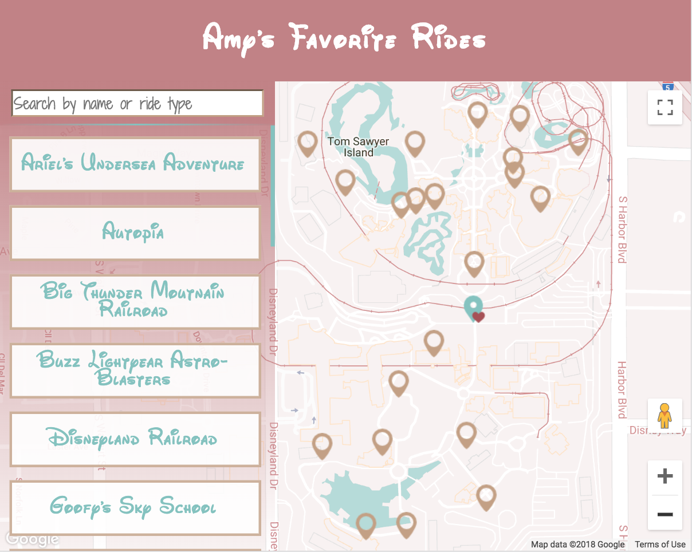
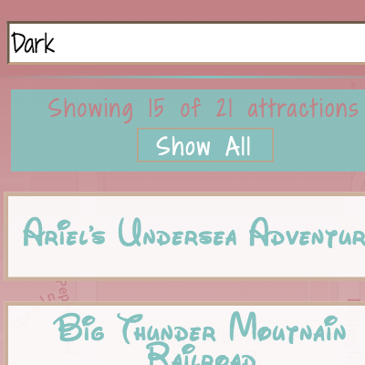
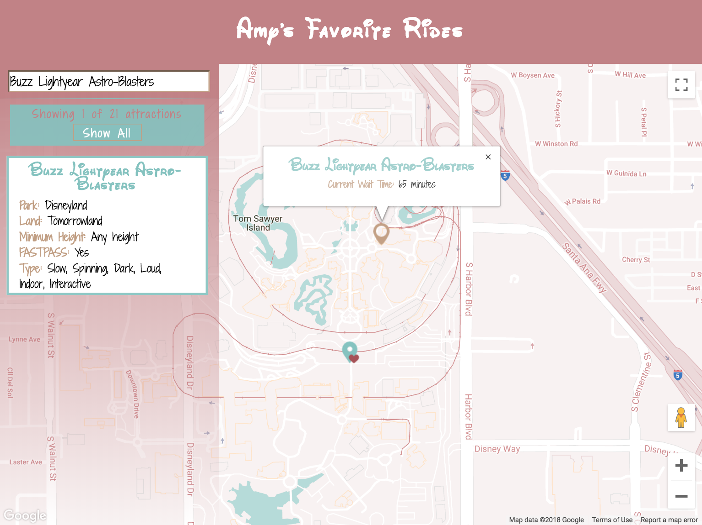
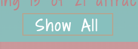
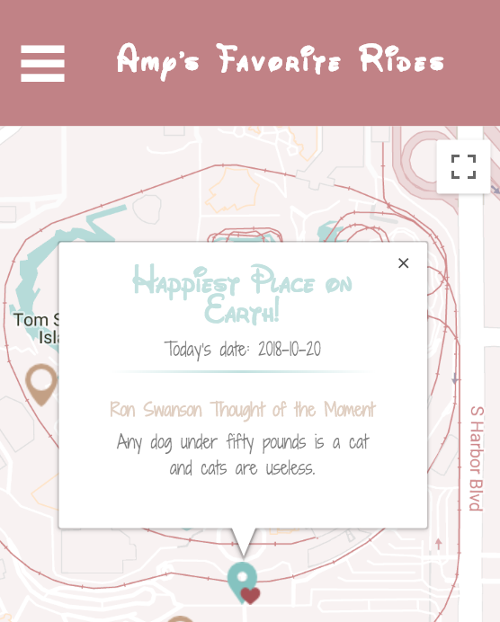

# Neighborhood Map

### About
This Neighborhood Map project (the seventh and final project for [Udacity's Front-End Web Development Nanodegree Program](https://www.udacity.com/course/front-end-web-developer-nanodegree--nd001))
demonstrates my ability to create a single page web application using a
JavaScript framework ([React JS](https://reactjs.org/)), a map API (Google Maps API),
and at least one non-Google third-party API.

My map shows my favorite rides in Disneyland and Disney California Adventure.  Using
the [Themeparks API](https://www.npmjs.com/package/themeparks), I was able
to get updating wait times for each ride.

Additionally, as a fan of the show Parks & Recreation, I added quotes I imagine one would overhear Ron Swanson say during his time at Disneyland Resort.

### Getting Started
1. Clone/Download [repository](https://github.com/amyFEND/Neighborhood-Map.git) from [Amy's GitHub](https://github.com/amyFEND/Neighborhood-Map) or view sample: [here](https://amyfend.github.io/Neighborhood-Map/)
2. `npm install` - Runs the app in the development mode
3. `npm start` - Opens [http://localhost:3000](http://localhost:3000) in the default browser
  - To start the Wait Times API (via [ExpressJS](https://expressjs.com/)):<br>
    ```
    $ cd neighborhood-map-themeparks
    $ PORT=3001 npm start
    ```

### Using the App

- Filter through my favorite rides by the following:
  - Searches can be done by ride name (i.e. 'Autopia') or ride type (i.e. 'Dark', 'Loud', 'Slow')
  
  - Clicking on any ride name in the left side bar, or
  - Click on any marker on the map
    <br />
    
- To clear the selection, click on
  
- Click on the main/center marker to see a funny quote from Ron Swanson
  <br />
  

#### Skills Used
- JavaScript
- HTML
- CSS
- Responsive Design
- Utilizing Asynchronous APIs such as:
  - Google Maps API
  - [Themeparks API](https://www.npmjs.com/package/themeparks)
  - [Ron Swanson Quote API](https://github.com/jamesseanwright/ron-swanson-quotes)

#### Reference Materials Used
- [Project Video Walkthrough by Forrest Walker](https://www.youtube.com/playlist?list=PL4rQq4MQP1crXuPtruu_eijgOUUXhcUCP)
- [How To Write a Google Maps React Component](https://www.fullstackreact.com/articles/how-to-write-a-google-maps-react-component/#the-map-container-component)
- [Google Maps React Tutorial](https://www.npmjs.com/package/google-maps-react)
- [React Google Maps](https://tomchentw.github.io/react-google-maps/)
- [Map Set Zoom to Markers](https://stackoverflow.com/questions/3334729/google-maps-v3-fitbounds-zoom-too-close-for-single-marker/3337093)
- [React Maps Style Help](https://github.com/tomchentw/react-google-maps/issues/53#issuecomment-344174297)
- [Snazzy Maps](https://snazzymaps.com/style/233722/neighborhood-map)
- [Style HRs](https://css-tricks.com/examples/hrs/)
- [Hamburger Menu](https://codepen.io/g13nn/pen/eHGEF)
- [Dropdown Filter](https://codepen.io/amwill/pen/OyByPq?editors=0010) <!-- Work In progress -->
- [Add Property to Array](https://stackoverflow.com/questions/38922998/add-property-to-an-array-of-objects)
- [Create Backend for React App](https://daveceddia.com/create-react-app-express-backend/)
